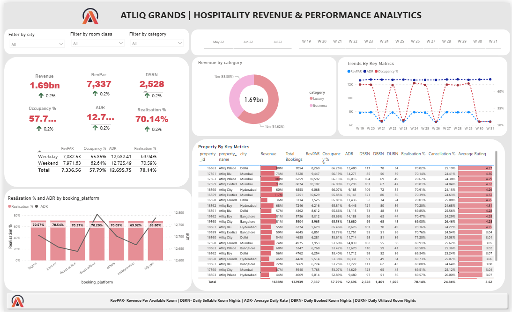

# AtliQ Grands – Hospitality Revenue & Performance Analytics Dashboard

## 📊 Project Overview

This project is an interactive Power BI dashboard developed to analyze
hospitality business performance.

The dashboard provides insights into revenue, occupancy, bookings,
pricing, realization, cancellations, customer ratings and property-level
performance.

## 🎯 Business Objective

The objective of this dashboard is to help hotel management understand:

- Revenue performance
- Occupancy trends
- Booking performance
- Property-level performance
- Booking platform performance
- Customer ratings
- Cancellation rates
- Realisation percentage
- Revenue and occupancy trends over time

## 🛠️ Tools & Technologies

- Power BI
- Power Query
- DAX
- Microsoft Excel / CSV
- Data Modeling
- Data Visualization

## 📌 Key KPIs

- Revenue
- RevPAR
- Occupancy %
- ADR
- DSRN
- DBRN
- DURN
- Realisation %
- Cancellation %
- Average Rating

## 📈 Dashboard Analysis

### Revenue Analysis
Analyzed revenue performance by hotel category and property.

### Occupancy Analysis
Analyzed occupancy percentage across different properties
and day types.

### Booking Platform Analysis
Compared realization percentage and ADR across different
booking platforms.

### Property Performance
Compared hotels using revenue, bookings, RevPAR, occupancy,
ADR, realization, cancellation rate and average rating.

### Trend Analysis
Analyzed weekly trends for RevPAR, ADR and occupancy.

## 📷 Dashboard Preview

## 📂 Dataset

The dataset contains information related to:

- Hotel properties
- Cities
- Room categories
- Booking dates
- Check-in and check-out dates
- Booking platforms
- Booking status
- Revenue
- Customer ratings

## 👨‍💻 Author

Ayush Ranjan

### Skills Demonstrated

Power BI | DAX | Power Query | Data Analysis |
Data Visualization | Business Intelligence
